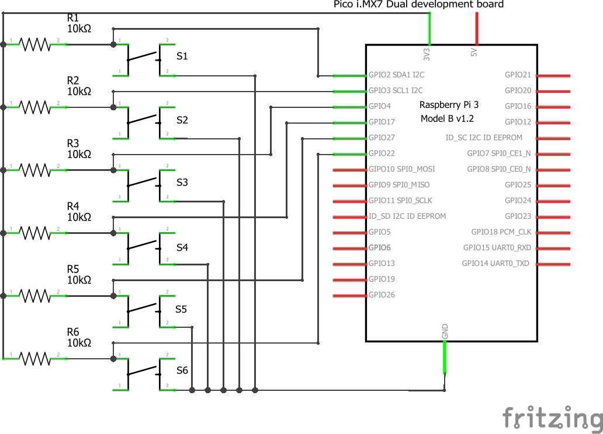

HW 2 - Text Entry
=====================================
## Android Things Braille Keyboard

This keyboard uses the orientation of the braille alphabet to input each letter. Six buttons are arranged so the braille equivalent of each letter can be pressed at one time to input that letter.

Click for a video!

